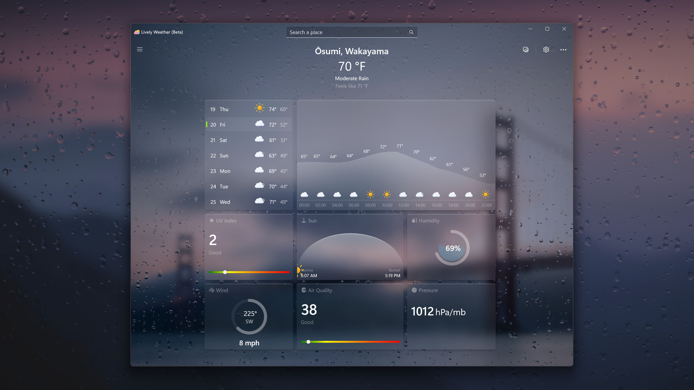

## About

Windows native weather app powered by DirectX12 animations.

  
  <h2 align="center">Lively Weather</h2>

## Contents

- [Features](#features)
- [Download](#download)
- [Building](#building)

## Features

### 100% Native

- Native UWP app powered by DX12, Win2D.
- Fast startup and small install size.
- Fluent inspired clean design.
### Desktop First
https://github.com/rocksdanister/weather/assets/17554161/f12c8ab1-20db-4ced-9086-a33e0d724915

- Desktop first design and features.
- Snow and other weather particles that move with inertia when window is moved. 
- Subtle weather pause animation when window out of focus.
### Weather Forecast
https://github.com/rocksdanister/weather/assets/17554161/a18f926b-ab40-4fa9-b573-3ab9ad08aed8

 - Weekly weather and air quality forecast.
 - Switch between multiple weather sources.
 - Pin forecast for upto 5 locations.
### White Noise
https://github.com/rocksdanister/weather/assets/17554161/401aeddf-f436-4618-86a9-b4882d80b02e

- Relax with weather white noise sound effects that dynamically changes with the visual.
- Select custom sound in screensaver mode and use it as white noise app.
 ### Fun
https://github.com/rocksdanister/weather/assets/17554161/350d1b69-0d05-4f2f-ae1b-6da126fb75d8

- Create your own weather in screensaver mode!
- Create depth background effects using AI.
- Fullscreen mode.

## Building

Install the .NET 6 SDK from https://dotnet.microsoft.com/en-us/download (if not already done so).

Then from a cmd prompt:

git clone https://github.com/microsoft/onnxruntime
cd onnxruntime
git remote add tommcdon https://github.com/tommcdon/onnxruntime
git fetch --all
git switch -t tommcdon/removeRefReturns
cd csharp\src\Microsoft.ML.OnnxRuntime
dotnet pack -c release /p:PackageVersion=5.0.0
Add the csharp\src\Microsoft.ML.OnnxRuntime\bin\Release to the feed.

Open nuget package manager and update the Microsoft.ML.OnnxRuntime.Managed package to the 5.0.0 version we just built.

XAML Designer Bug
image
Visual studio designer hangs and shows busy message after a few clicks.

On the dialog after Cancel is selected choose the 2nd option for stability.

Don't know the cause, this started happening(?) after I edited WinUI NavView template and added to App.xaml.

Note
Documenting the changes made for building in Release with .NET Native

Modified version of OnnxRuntime.Managed package is used without ref struct return.

In Drizzle.UI.UWP/Properties/Default.rd.xml the following changes made for Trimming related issue.

<Assembly Dynamic="Required All" Name="Microsoft.Extensions.Options"/>
<Assembly Dynamic="Required All" Name="Microsoft.Extensions.Logging"/>
<Assembly Dynamic="Required All" Name="Microsoft.Extensions.Http"/>
(Optional) To reduce CPU usage during build in Drizzle.UI.UWP/Drizzle.UI.UWP.csproj
<IlcParameters>/ExtraNutcArguments:"/d2threadsN"</IlcParameters>
with N being whatever many cores you want to use (eg. d2threads4 uses 4 cores)
